# Como realiza una instalacion instancia en AWS

Para poder crear una instancia en AWS, tendremos que acceder a la pagina de AWS,
una vez en la página principal, en el pequeño menu que nos aparece a la izquierda
buscaremos Contenidos.

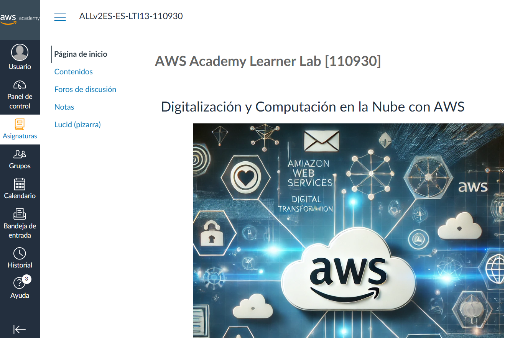

Una vez dentro de Contenidos, nos apareceran varias opciones y buscaremos,
"Laboratorio para el alumnado de AWS Academy" que en este caso solo tendremos 
una opcion.

En esta pantalla, lo que tendremos que hacer sera simplemente en parte superior 
derecha "Start Lab" y esperaremos a que se ponga en verde el boton rojo que sale
en la parte central superior un poco a la izquierda.

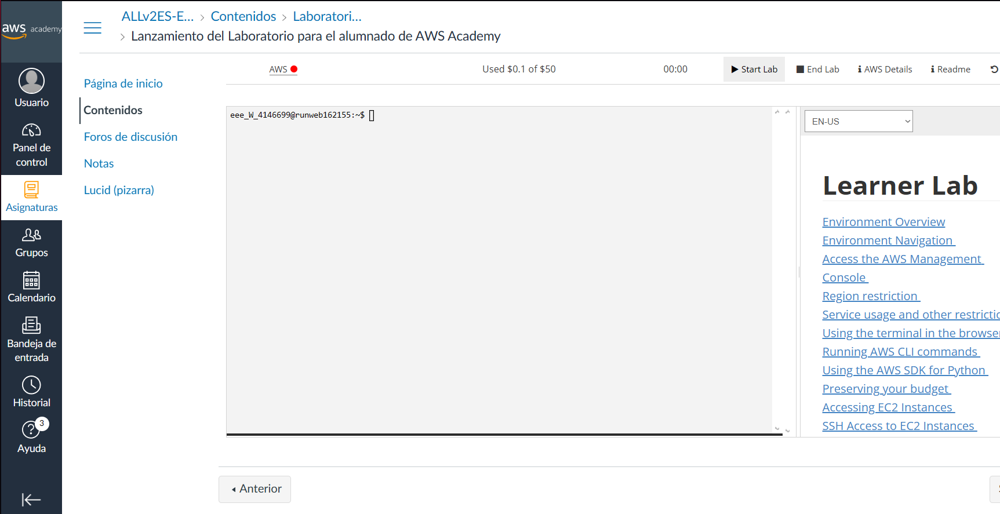

Una vez en verde, haremos click encima AWS.

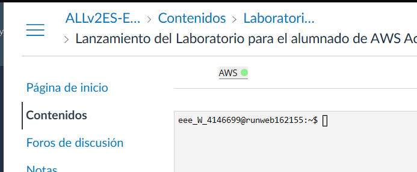

Una vez en la página de inicio de la consola, tendremos que acceder a EC2.

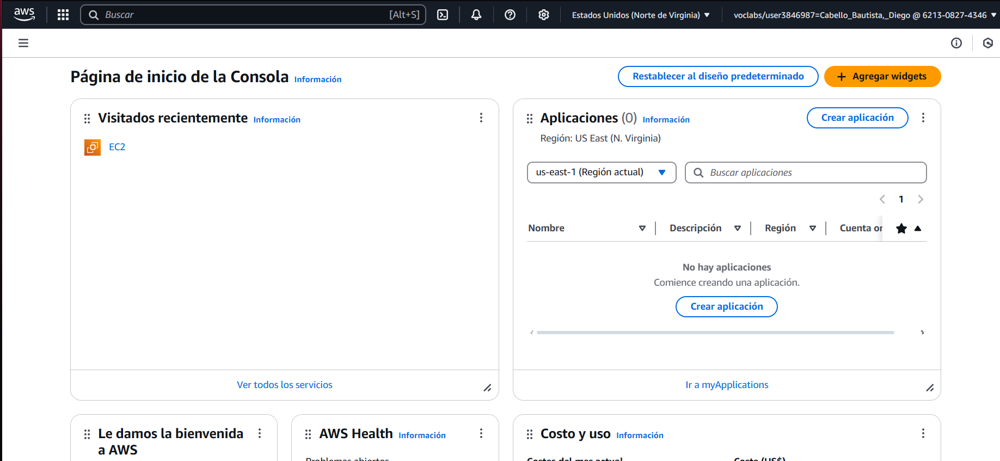

Cuando ya estemos dentro de EC2 en el listado en la parte izquierda de la pantalla
encontramos "Instancias", accederemos a ellas.

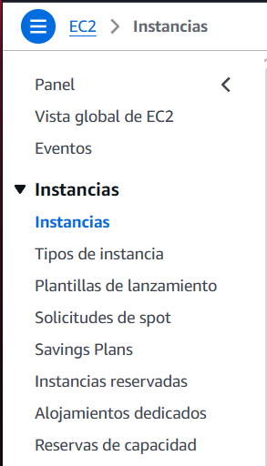

Para lanzar una instancia, deberemos de hacer click encima de lanzar instancia en
la parte superior derecha.

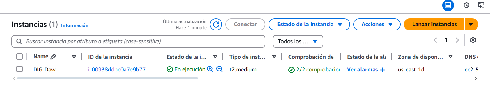

Tendreos que elegir un nombre para la instancia que vamos a crear a continuacion.

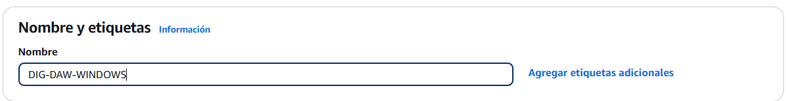

Seleccionaremos la opcion de Windows.

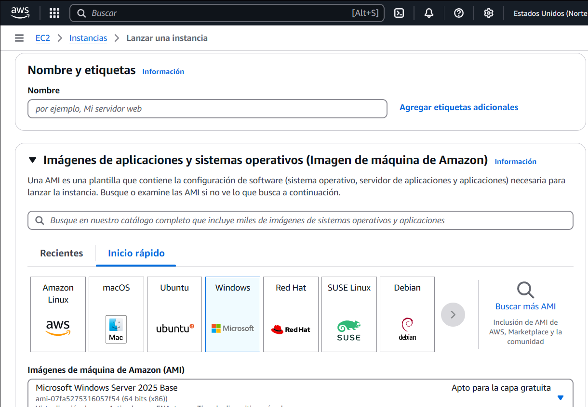

El tipo de instancia crearemos la medium, que tendremos más recursos para dicha instancia
pero nos costaria más.

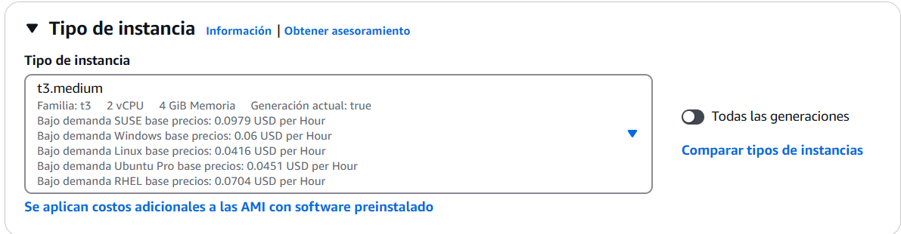

Tendremos que crear un nuevo par de claves.

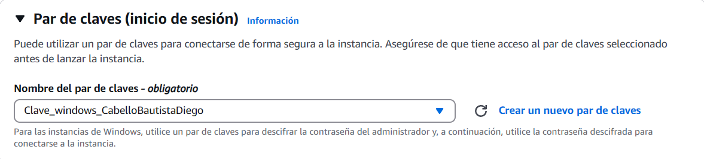

Seleccionamos el nombre de el par de claves, el tipo RSA, y en formato .pem

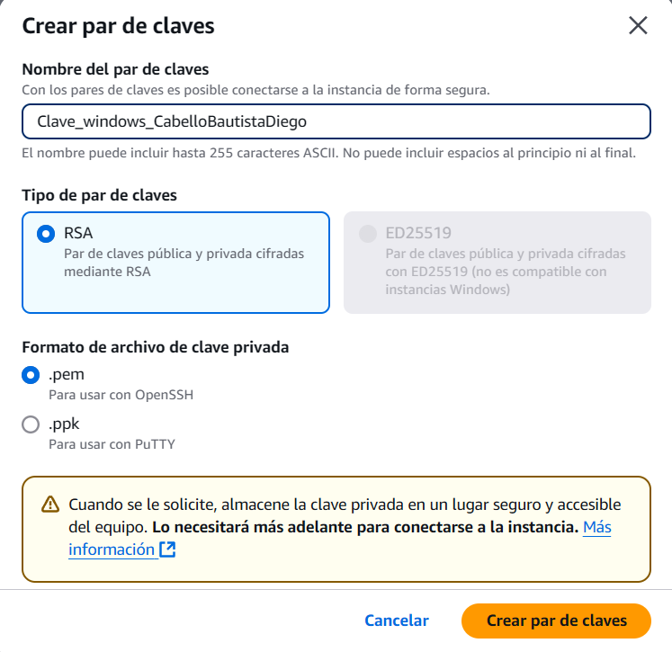

En configuraciones de red, en este caso la dejaremos en predeterminado.

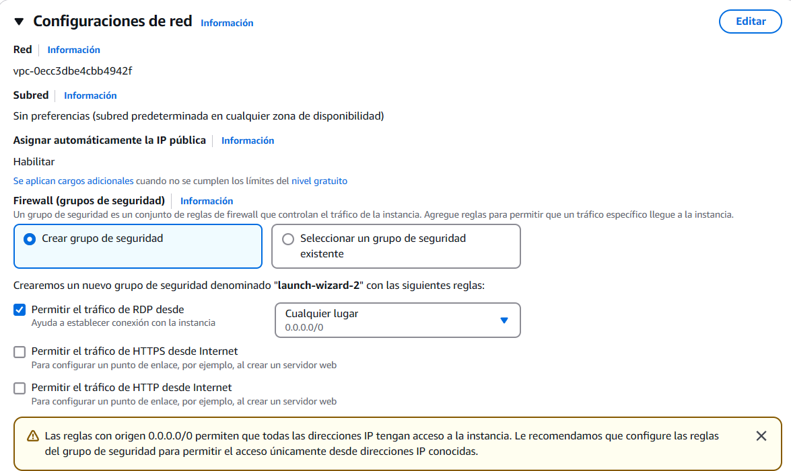

Lo mismo con la configuracion de almacenamiento.

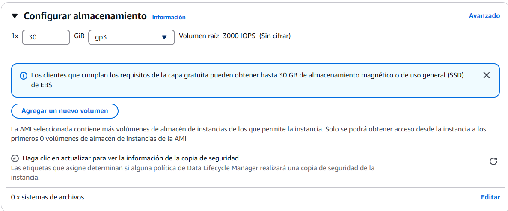

Lanzaremos la instancia, para finalizar el proceso.

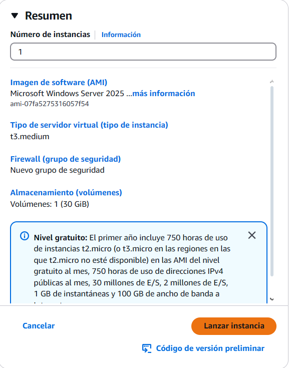

Una vez creada la instancia, podremos ver que se ha creado pero no podremos acceder
a el ya que esta recien creada dicha instancia y nos tendremos que esperar un par
de minutos

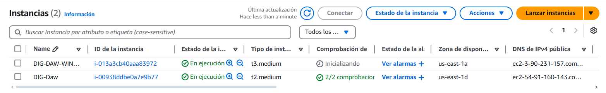

Cuando pasan 2 minutos probamos a actualizar y podremos ver que ya esta disponible
para probar a conectarnos.

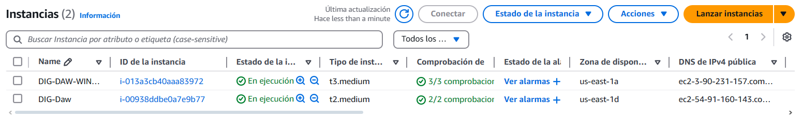

Para conectarnos seleccionamos la instancia a la que queremos conectarnos, y en la esquina 
superior derecha hacemos click encima de conectar.

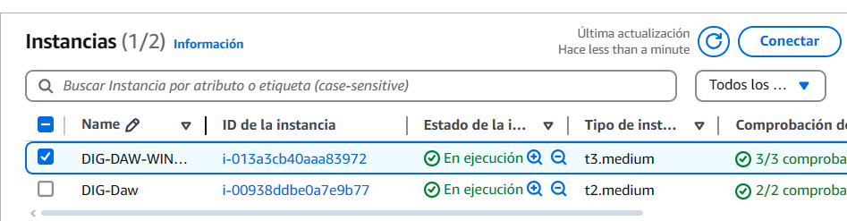

Cuando nos conectamos a la instancia seleccionamos "Cliente de RDP".

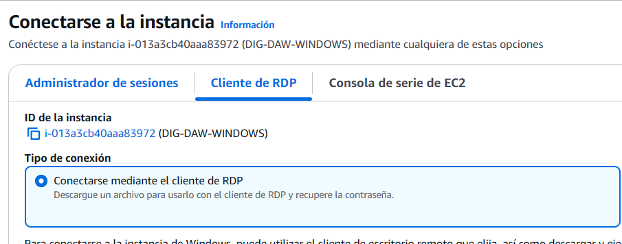

Tendremos que descargar el archivo de escritorio remoto

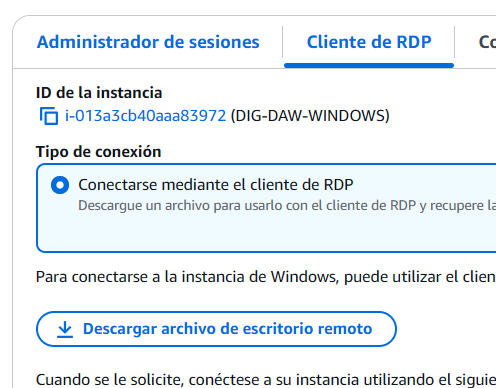

Una vez descargado el escritorio remoto, tendremos que obtener la contraseña.

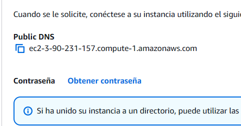

Tenemos que subir el archivo que se nos haya creado anteriormente cuando creamos
la contraseña para que se nos descifre y poder acceder a el escritorio remoto.

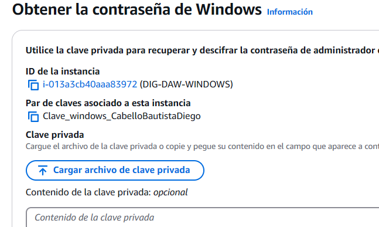

Intentaremos acceder a el escritorio remoto y pondremos la contraseña descifrada.

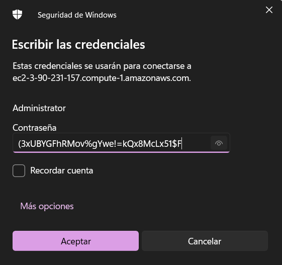

Nos saldria un aviso y lo aceptaremos.
Y ya podremos acceder finalmente a la instancia.

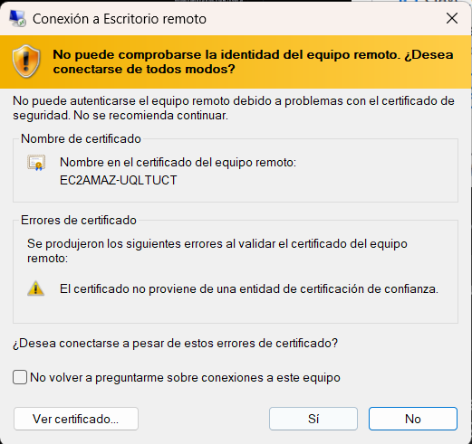
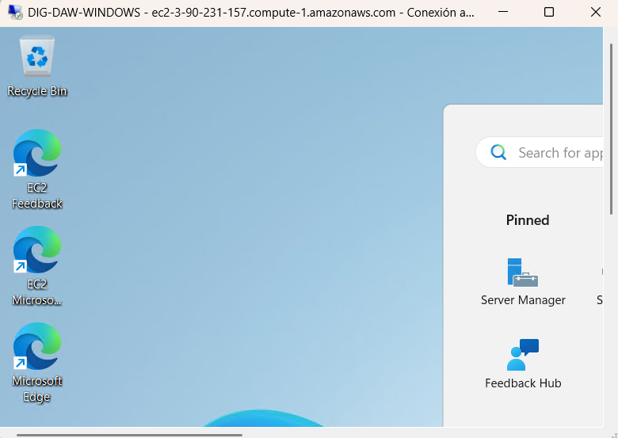
